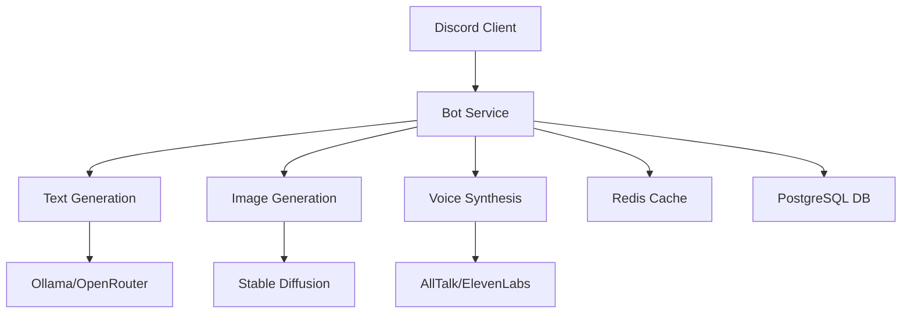
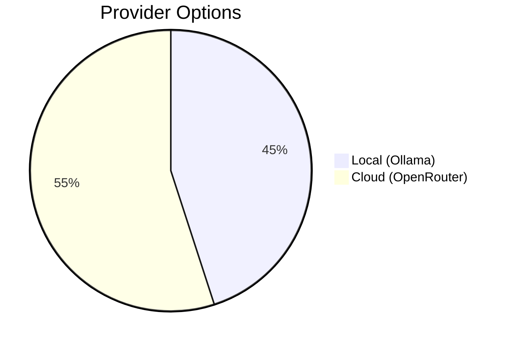

# Multimodal Discord Bot 🤖🎨🎤

A feature-rich Discord bot with **AI-powered text generation**, **image creation**, and **voice synthesis** capabilities. Built with TypeScript and Docker for seamless deployment. Choose between local or cloud-based AI providers for each modality!

## 🌟 Features

### 🤖 Intelligent Text Generation

- **Local AI**: Ollama amd AllTalk TTS integration for private LLM interactions
- **Cloud AI**: OpenRouter and ElevenLabs support for cutting-edge models.
- Context-aware conversations with configurable memory
- System message customization for personality control,

### 🎨 Dynamic Image Generation

- Integration with Stable Diffusion WebUI Forge
- Support for custom model checkpoints
- High-quality image synthesis from text prompts
- Fast GPU-accelerated generation (when using local SD instance)

### 🎤 Natural Voice Synthesis

- **Local TTS**: AllTalk for private voice generation
- **Cloud TTS**: ElevenLabs integration for human-like voices
- Automatic voice message handling
- Multiple voice model support

### ⚙️ Infrastructure

- Redis-based conversation caching
- PostgreSQL interaction logging
- Docker-first architecture
- Configurable through environment variables
- Modular command system

## 🚀 Quick Start

### Prerequisites

- Node.js 18+
- Docker & Docker Compose
- Discord Developer Account
- AI Provider Accounts (as needed)

### Installation

```bash
# Clone repository
git clone https://github.com/BenevolenceMessiah/multimodal-discord-bot
cd multimodal-discord-bot

# Copy environment template
cp .env.example .env

# Configure your settings (see below)
nano .env

# Build and start containers
docker compose build
docker compose up -d
```

## 🔧 Configuration

### Essential Environment Variables (`/.env`)

```env
# Discord Configuration
DISCORD_TOKEN=your_bot_token
CLIENT_ID=your_application_id
GUILD_ID=your_server_id

# AI Providers
TEXTGEN_PROVIDER=ollama             # ollama | openrouter
VOICEGEN_PROVIDER=alltalk           # alltalk | elevenlabs
IMAGEGEN_PROVIDER=stablediffusion

# API Keys (if using cloud services)
OPENROUTER_KEY=your_openrouter_key
ELEVENLABS_KEY=your_elevenlabs_key
```

### AI Endpoints Configuration (`/config.yaml`)

```yaml
endpoints:
  ollama: http://127.0.0.1:11434          # Local Ollama instance
  stablediffusion: http://127.0.0.1:7860  # Stable Diffusion WebUI
  alltalk: http://127.0.0.1:7851          # AllTalk TTS server
  elevenlabs: https://api.elevenlabs.io/v1
```

## 🎮 Command Reference

### Core Commands

| Command         | Description                      | Example                     |
|-----------------|----------------------------------|-----------------------------|
| `/say [prompt]` | Force immediate AI response      | `/say Explain quantum physics` |
| `/img [prompt]` | Generate image from text         | `/img Mystical forest at dusk`|
| `/clear`        | Reset conversation memory        | `/clear`                     |

### Thread Management

| Command               | Description                      | Example Usage            |
|-----------------------|----------------------------------|--------------------------|
| `/thread`             | Create public discussion thread  | `/thread`                |
| `/thread-private`     | Create private thread            | `/thread-private`        |

## 🛠 Advanced Setup

### Text Generation Options

```env
# Ollama Configuration
MODEL_OLLAMA=hf.co/.../FuseChat-Qwen-2.5-7B-Instruct-Q8_0-GGUF:Q8_0

# OpenRouter Configuration
MODEL_OPENROUTER=deepseek/deepseek-chat-v3-0324:free
```

### Voice Synthesis Settings

```env
# AllTalk Configuration
MODEL_ALLTALK=standard
ALLTALK_URL=http://127.0.0.1:7851

# ElevenLabs Configuration
ELEVENLABS_KEY=your_api_key
```

### Performance Tuning

```env
TEMPERATURE=0.4          # 0-1, higher = more creative
MAX_TOKENS=8192          # Maximum response length
CONTEXT_LENGTH=32768     # Conversation history limit
MAX_LINES=25             # Visible message history
```

## 🏗 Architecture



## 📦 Dependencies

### Core Services

- **Redis**: Conversation caching and message history
- **PostgreSQL**: Interaction logging and analytics
- **Docker**: Containerized service orchestration

### AI Providers



## 💡 Usage Tips

1. **Wake Words**: Use natural triggers like "hey bot" in conversation
2. **Context Awareness**: The bot maintains channel-specific memory
3. **Hybrid Mode**: Mix local and cloud providers for different modalities
4. **Rate Limiting**: Built-in safeguards prevent API abuse

## 🚨 Troubleshooting

Common Issues:

- **Connection Errors**: Verify AI service URLs in `config.yaml`
- **Permission Issues**: Ensure bot has proper Discord permissions
- **Memory Limits**: Adjust `MAX_TOKENS` and `CONTEXT_LENGTH` as needed

View logs with:

```bash
docker compose logs -f bot
```

## 📚 Documentation Links

- [Ollama Setup Guide](https://ollama.ai)
- [Stable Diffusion WebUI Documentation](https://github.com/AUTOMATIC1111/stable-diffusion-webui)
- [Discord Developer Portal](https://discord.com/developers/docs)

## 🤝 Contributing

PRs welcome! Please follow our [contribution guidelines]

1. Maintain TypeScript type safety
2. Keep Docker compatibility
3. Add tests for new features
4. Update documentation accordingly

## 📜 License

MIT License - See [LICENSE](LICENSE) for details
